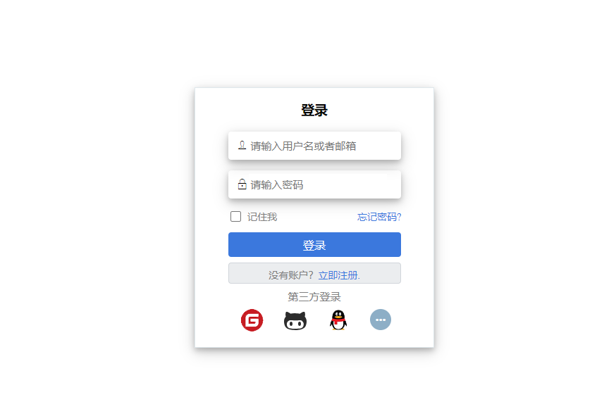

#### :monkey: SSO demo
    

|Author|:sunglasses:lucas234:sunglasses:|
|---|---|
|Email|:hearts:ly_liubo@163.com:hearts:|

#### :monkey: 概述
基于[JustAuth](https://github.com/justauth/JustAuth), 简单写了一个python版本的，目前只集成了三个平台

#### :monkey: 集成平台
- Github([参考文档](https://docs.github.com/en/developers/apps/building-oauth-apps/authorizing-oauth-apps))
- Gitee([参考文档](https://gitee.com/api/v5/oauth_doc#/))
- QQ([参考文档](https://wiki.connect.qq.com/))

#### :monkey: 快速应用
安装依赖文件：

`pip install -r requirements.txt`

运行`app.py`:

`python app.py`

浏览器打开`http://localhost:5000/` 即可


#### :monkey: 扩展

如果想添加平台，只需在`request`文件夹下添加对应的平台类:
```python
class AuthGithubRequest(AuthBaseRequest):
    # https://docs.github.com/en/developers/apps/building-oauth-apps/authorizing-oauth-apps
    source = AuthSource.GITHUB

    def __init__(self, config):
        self.client_id = config.get("client_id")
        self.client_secret = config.get("client_secret")
        self.redirect_uri = config.get("redirect_uri")

    def get_access_token(self, code):
        body = {
            "client_id": self.client_id,
            "client_secret": self.client_secret,
            "code": code}
        header = {"Accept": "application/json"}
        response = requests.post(self.source.get("access_token"), json=body, headers=header)
        result = response.json()
        return result.get("access_token")

    def get_user_info(self, access_token):
        header = {"Authorization": f"token {access_token}"}
        response = requests.get(self.source.get("user_info"), headers=header)
        result = response.json()
        return result

    def authorize(self):
        params = {
            "client_id": self.client_id,
            "redirect_uri": self.redirect_uri,
            "scope": "user",
            "state": get_real_state()
        }
        return build_url(self.source.get("authorize"), params)

```

在`auth_source.py`中添加该平台的`url`, 例如:
```python
GITHUB = {
        "authorize": "https://github.com/login/oauth/authorize",
        "access_token": "https://github.com/login/oauth/access_token",
        "user_info": "https://api.github.com/user",
    }
```
以及在`auth_config.py` 添加配置:
```python
 GITHUB = {
        "client_id": "",
        "client_secret": "",
        "redirect_uri": "http://localhost:5000/oauth/callback/github",
    }
```

最后在app.py中添加新加入的平台即可
```python
def get_auth_request(platform):
    auth_requests = {
        "gitee": lambda: AuthGiteeRequest(AuthConfig.GITEE),
        "github": lambda: AuthGithubRequest(AuthConfig.GITHUB),
        "qq": lambda: AuthQqRequest(AuthConfig.QQ),
    }

```
